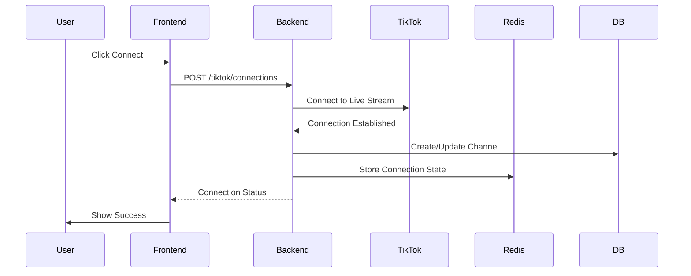
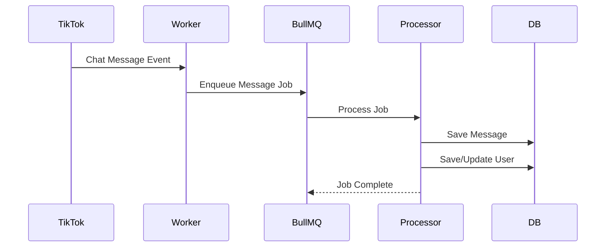
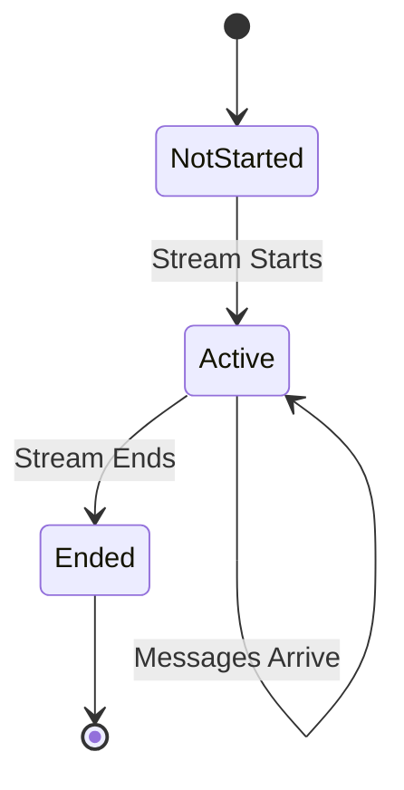

# Kiến trúc và Tech Stack

Tài liệu mô tả kiến trúc hệ thống, tech stack, và luồng dữ liệu của TikTok Live Assistant.

## 🏗️ Kiến trúc Tổng quan

TikTok Live Assistant được xây dựng theo kiến trúc **monorepo** với backend và frontend tách biệt:

```
┌─────────────────┐         ┌─────────────────┐
│   Frontend      │◄────────►│    Backend      │
│   (React)       │  HTTP    │   (NestJS)      │
│   Port: 5173    │          │   Port: 3000    │
└─────────────────┘          └─────────────────┘
                                      │
                    ┌─────────────────┼─────────────────┐
                    │                 │                 │
            ┌───────▼──────┐  ┌───────▼──────┐  ┌───────▼──────┐
            │  PostgreSQL  │  │    Redis     │  │ TikTok Live │
            │   Database   │  │   Queue      │  │    API      │
            └──────────────┘  └──────────────┘  └──────────────┘
```

## 📚 Tech Stack Chi tiết

### Backend Stack

#### Core Framework
- **NestJS 11.x** - Progressive Node.js framework
  - Modular architecture
  - Dependency injection
  - Decorators và metadata
  - Built-in TypeScript support

#### Database & ORM
- **PostgreSQL 14+** - Relational database
  - ACID compliance
  - JSON support
  - Full-text search
- **TypeORM 0.3.x** - Object-Relational Mapping
  - Entity decorators
  - Migrations
  - Relations management
  - Query builder

#### Caching & Queue
- **Redis 6+** - In-memory data store
  - Session storage
  - Cache layer
- **BullMQ 5.x** - Queue management
  - Job processing
  - Retry mechanism
  - Priority queues
  - Worker management

#### External Libraries
- **tiktok-live-connector 2.1.1-beta1** - TikTok Live API client
- **ioredis 5.x** - Redis client
- **pg 8.x** - PostgreSQL client

#### Development Tools
- **TypeScript 5.7** - Type-safe JavaScript
- **ESLint** - Code linting
- **Prettier** - Code formatting
- **Jest** - Testing framework
- **Swagger** - API documentation

### Frontend Stack

#### Core Framework
- **React 19.x** - UI library
  - Functional components
  - Hooks API
  - Context API
- **TypeScript 5.9** - Type-safe JavaScript

#### Build Tool
- **Vite 7.x** - Next-generation build tool
  - Fast HMR
  - Optimized builds
  - ES modules

#### Styling
- **Tailwind CSS 4.x** - Utility-first CSS
  - Custom theme
  - Responsive design
  - Dark mode support

#### Routing & State
- **React Router 7.x** - Client-side routing
- **Zustand 5.x** - State management (optional)
- **React Context** - Global state

#### HTTP Client
- **Axios 1.x** - Promise-based HTTP client
  - Interceptors
  - Request/Response transformation

#### Authentication
- **@react-oauth/google 0.13.x** - Google OAuth integration

#### Utilities
- **date-fns 4.x** - Date manipulation
- **react-icons 5.x** - Icon library

## 🗄️ Database Schema

### Entity Relationship Diagram

```
┌─────────────────┐
│  LiveChannel    │
│─────────────────│
│ id (UUID)       │
│ username        │◄────┐
│ enabled         │     │
│ isAlwaysActive  │     │
│ expiredDate     │     │
│ lastStatus      │     │
└─────────────────┘     │
                        │
┌─────────────────┐     │
│  LiveSession    │     │
│─────────────────│     │
│ id (VARCHAR)    │     │
│ hostUsername    │─────┘
│ startedAt       │
│ endedAt         │
└────────┬────────┘
         │
         │ 1:N
         │
┌────────▼────────┐
│ LiveChatMessage │
│─────────────────│
│ id (UUID)       │
│ session (FK)    │
│ user (FK)       │───┐
│ message         │   │
│ sentAt          │   │
└─────────────────┘   │
                      │
         ┌────────────┘
         │
┌────────▼────────┐
│   LiveUser      │
│─────────────────│
│ id (UUID)       │
│ uniqueId        │
│ nickname        │
│ avatarUrl       │
└─────────────────┘
```

### Tables

#### live_channel
- `id` (UUID, Primary Key)
- `username` (VARCHAR, Unique)
- `enabled` (BOOLEAN)
- `isAlwaysActive` (BOOLEAN)
- `expiredDate` (TIMESTAMP, Nullable)
- `lastStatus` (VARCHAR, Nullable)
- `lastConnectedAt` (TIMESTAMP, Nullable)
- `lastDisconnectedAt` (TIMESTAMP, Nullable)

#### live_session
- `id` (VARCHAR, Primary Key) - roomId from TikTok
- `hostUsername` (VARCHAR)
- `startedAt` (TIMESTAMP)
- `endedAt` (TIMESTAMP, Nullable)

#### live_chat_message
- `id` (UUID, Primary Key)
- `session` (FK → live_session)
- `user` (FK → live_user, Nullable)
- `message` (TEXT)
- `sentAt` (TIMESTAMP)

#### live_user
- `id` (UUID, Primary Key)
- `uniqueId` (VARCHAR, Unique)
- `nickname` (VARCHAR, Nullable)
- `avatarUrl` (VARCHAR, Nullable)

## 🔄 Luồng Dữ liệu

### Connection Flow



### Message Processing Flow



### Session Lifecycle



## 🏛️ Backend Architecture

### Module Structure

```
backend/src/
├── app.module.ts          # Root module
├── main.ts               # Bootstrap
├── database/
│   └── database.module.ts # Database configuration
├── redis/
│   └── redis.module.ts   # Redis configuration
└── tiktok-live/
    ├── tiktok-live.module.ts
    ├── tiktok-live.service.ts
    ├── tiktok-live.controller.ts
    ├── tiktok-live.worker.ts
    ├── entities/
    │   ├── live-channel.entity.ts
    │   ├── live-session.entity.ts
    │   ├── live-chat-message.entity.ts
    │   └── live-user.entity.ts
    └── queues/
        ├── chat-queue.module.ts
        └── chat-queue.processor.ts
```

### Service Layer Pattern

- **TiktokLiveManagerService**: Quản lý connections và channels
- **TiktokLiveWorker**: Xử lý TikTok Live events
- **ChatQueueProcessor**: Xử lý chat messages từ queue

### Queue Architecture

```
TikTok Live → Worker → BullMQ Queue → Processor → Database
                      ↓
                    Redis
```

## 🎨 Frontend Architecture

### Component Structure

```
frontend/src/
├── components/
│   ├── Auth/
│   │   └── GoogleLoginButton.tsx
│   ├── Dashboard/
│   │   ├── StatsCards.tsx
│   │   ├── SessionsTable.tsx
│   │   ├── ConnectionsPanel.tsx
│   │   └── ChannelsPanel.tsx
│   ├── Layout/
│   │   ├── Sidebar.tsx
│   │   ├── Header.tsx
│   │   └── DashboardLayout.tsx
│   └── ProtectedRoute.tsx
├── pages/
│   ├── Login.tsx
│   └── Dashboard.tsx
├── services/
│   └── api.ts           # API client
├── context/
│   └── AuthContext.tsx  # Auth state
└── hooks/
    └── useAuth.ts       # Auth hook
```

### State Management

- **Context API**: Authentication state
- **Local State**: Component-specific state
- **Server State**: API data (có thể dùng React Query trong tương lai)

### Routing Structure

```
/login                    # Public route
/dashboard                # Protected route
  ├── /sessions          # Sessions view
  ├── /connections       # Connections view
  └── /channels         # Channels view
```

## 🔌 API Architecture

### RESTful Endpoints

```
GET    /tiktok/status                    # System status
GET    /tiktok/sessions                  # List sessions
GET    /tiktok/sessions/:id/chats       # Session chats
GET    /tiktok/channels                  # List channels
GET    /tiktok/connections               # Active connections
POST   /tiktok/connections               # Connect channel
DELETE /tiktok/connections/:username    # Disconnect
POST   /auth/google                      # Google OAuth
```

### Request/Response Flow

```
Client Request
    ↓
Axios Interceptor (Add JWT)
    ↓
Backend Controller
    ↓
Service Layer
    ↓
Repository/ORM
    ↓
Database/External API
    ↓
Response
    ↓
Axios Interceptor (Handle 401)
    ↓
Client
```

## 🔐 Security Architecture

### Authentication Flow

```
User → Google OAuth → Backend → Verify Token → Generate JWT → Frontend
                                                              ↓
                                                         Store in localStorage
```

### Token Management

- **Access Token**: Stored in localStorage
- **Refresh Token**: (Có thể implement)
- **Token Expiry**: Handled by interceptor

### CORS Configuration

- Backend cần cấu hình CORS để cho phép frontend origin
- Credentials: true cho cookies (nếu cần)

## 📦 Deployment Architecture

### Development
```
Frontend (Vite Dev Server) → Backend (NestJS Dev) → Local DB/Redis
```

### Production (Recommended)
```
Frontend (Static Build) → Nginx → Backend (NestJS) → PostgreSQL/Redis
```

### Environment Variables
- Development: `.env` files
- Production: Environment variables hoặc secrets manager

## 🚀 Performance Optimizations

### Backend
- Queue processing cho messages
- Database indexing
- Redis caching
- Connection pooling

### Frontend
- Code splitting
- Lazy loading
- Memoization
- Optimized re-renders

## 📈 Scalability Considerations

### Horizontal Scaling
- Stateless backend → Multiple instances
- Redis shared state
- Database connection pooling

### Vertical Scaling
- Worker processes
- Queue workers scaling
- Database optimization

## 🔍 Monitoring & Logging

### Recommended Tools
- **Winston** hoặc **Pino** cho logging
- **Prometheus** cho metrics
- **Sentry** cho error tracking

## 📝 Future Architecture Improvements

- WebSocket cho real-time updates
- GraphQL API layer
- Microservices architecture
- Event-driven architecture
- CQRS pattern
- Message broker (RabbitMQ/Kafka)
